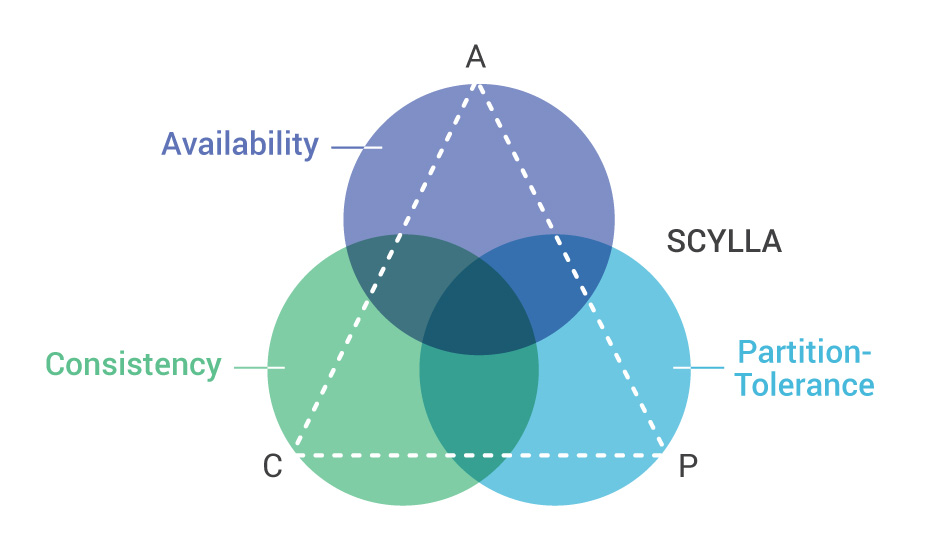

### DragonFly
## CP

Из предоставленных данных и анализа сообщений выше можно сделать следующие выводы относительно теоремы CAP и системы DragonFly:

Consistency (C): DragonFly стремится к обеспечению согласованности данных. Он использует асинхронное дублирование данных между главным узлом и вторичными копиями, а также применяет гибридную модель для согласованности данных. Однако, в случае сетевого разделения (P), система может временно допускать расхождения между репликами в угоду доступности и производительности.

Availability (A): DragonFly ориентирован на высокую доступность. При отказе главного узла система использует Sentinels, чтобы повысить одну из вторичных копий до роли мастера, обеспечивая тем самым непрерывную доступность к данным.

Partition Tolerance (P): DragonFly обеспечивает устойчивость к разделениям сети. В случае сетевого разделения, система становится недоступной в миноритарной части, что соответствует требованию устойчивости к разделениям сети.

С учетом этих характеристик можно сказать, что DragonFly, в большей степени, выглядит как CP-система (Consistency and Partition Tolerance). Временные расхождения между репликами в условиях разделения сети указывают на приоритет согласованности данных даже за счет временного отсутствия доступности в миноритарной части.

### ScyllaDB
## AP
ScyllaDB придерживается Теоремы CAP следующим образом:

ScyllaDB выбирает доступность и устойчивость к разделению данных в ущерб согласованности, таким образом:

Невозможно одновременно обеспечить согласованность и высокую доступность в условиях сетевого разделения;

Если мы жертвуем согласованностью, мы можем достичь высокой доступности.

https://www.scylladb.com/glossary/cap-theorem/

### Arenadata DB
## CA
Полное соответствие принципам строгой изоляции транзакции (принципы ACID). Одни и те же таблицы могут быть использованы для записи и чтения, без страха потерять данные.
Гибкая система резервирования позволяет установить и настроить кластер с заранее заданным уровнем отказоустойчивости, позволяя СУБД работать даже при выходе из строя половины серверов из кластера. 

https://arenadata.tech/products/arenadata-db/?ysclid=lsrroml6q5953185698