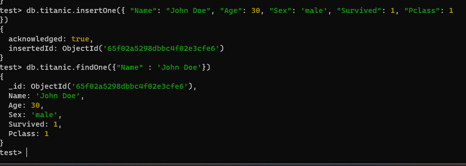
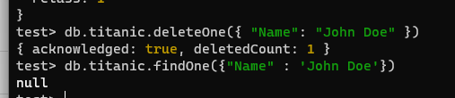

# Отчет по выполнению ДЗ 1: Работа с MongoDB 

## Шаги выполнения
 
### Установка
Установка происходила в WSL Ubuntu 22.
```bash
sudo apt update
wget -qO - https://www.mongodb.org/static/pgp/server-5.0.asc | sudo apt-key add -
echo "deb [ arch=amd64,arm64 ] https://repo.mongodb.org/apt/ubuntu focal/mongodb-org/5.0 multiverse" | sudo tee /etc/apt/sources.list.d/mongodb-org-5.0.list
sudo apt-get update
```
Проверяем установленную версию

Запускаем монго и проверяем, что он запущен
```bash
ps -e | grep 'mongod'
```


### Создание бд
Я выбрала датасет: [Titanic dataset](https://web.stanford.edu/class/archive/cs/cs109/cs109.1166/problem12.html).

Импортирую файл в базу данных


### Выполнение CRUD запросов
Вставка и проверка наличия нового элемента в бд


Update запрос и проверка результатов

Delete запрос и проверка, что элемент удален.



### Запросы с агрегацией 
Выяснить средний возраст выживших пассажиров по каждому классу:


Найти количество пассажиров мужского и женского пола в каждом классе:


### Сравнение производительности запросов выборки

Т.к. датасет титаника оказался слишком маленьким для наглядных результатов по времени выполнения запроса я скачала [Fake News Detection Dataset](https://www.kaggle.com/c/fake-news/data)

Производительность при find запросе без индексов

Создаем индекс по полю "label" и снова делаем find запрос:

Производительность при find запросе с индексами


Получили, что время выполнения запроса (ExecutionTimeMillis) уменьшилось с 51 до 13, mongodb просканировал почти в два раза меньше документов 