### История развития СУБД
* Изначально, в ноябре 2006 года Google опубликовала документацию о [BigTable](https://static.googleusercontent.com/media/research.google.com/fr//archive/bigtable-osdi06.pdf).
* Первый прототип HBase был создан как вклад в проект Hadoop в феврале 2007 года.
* Первая полнофункциональная версия HBase была выпущена в октябре 2007 года вместе с Hadoop 0.15.0.
* В январе 2008 года HBase стал подпроектом Hadoop.
* Январь 2009 выпущена HBase 0.19.0
* Сентябрь 2009 выпущена HBase 0.20.0
* В мае 2010 года HBase стал проектом верхнего уровня Apache.
#### Определения

HBase - это распределенная колоночно-ориентированная база данных, построенная поверх файловой системы Hadoop. Это проект с открытым исходным кодом и обеспечивает горизонтальное масштабирование.

Apache HBase - это колоночно-ориентированное хранилище данных типа ключ/значение, разработанное для работы поверх распределенной файловой системы Hadoop (HDFS).

Hadoop - это фреймворк для работы с большими наборами данных в распределенной вычислительной среде.
### Инструменты для взаимодействия с СУБД
**HBase shell**:
Для запуска hbase shell используется следующая команда: ` ./bin/hbase shell`

Вы можете использовать **Java API Apache HBase** для взаимодействия с Apache HBase. Java API является одним из наиболее распространенных способов взаимодействия с HBase.

**REST Apache HBase**
Через REST сервер вы можете создавать, удалять таблицы и выполнять другие операции. Кроме того, можно настроить SSL для шифрования данных и использовать REST сервер как шлюз между различными сетями для безопасного доступа к данным.

**Apache Thrift Proxy API** позволяет создавать клиентский код на разных языках (например, Python, C++) для взаимодействия с сервером Thrift, что позволяет писать приложения для HBase на этих языках. 

Интеграция Apache HBase с **Apache Hive** позволяет создавать таблицы HBase и изменять таблицы Apache HBase из Apache Hive. Интеграция HBase Hive позволяет читать и записывать данные в существующие таблицы HBase. 

**HBase-Spark connector** - позволяет  считывать данные из HBase в dataframe Spark, после чего можно выполнять дополнительные преобразования данных. 

**Hue HBase app** -- это веб-интерфейсный редактор интерактивных запросов

### Какой database engine используется в вашей СУБД?
HBase использует собственный движок базы данных, который построен на распределенной файловой системе Hadoop (HDFS)
### Как устроен язык запросов в вашей СУБД? Разверните БД с данными и выполните ряд запросов. 

Первый набор операций используется для вставки, обновления и удаления строк и столбцов.

Put

Put добавляет новые строки в таблицу (если ключ новый) или может обновить существующие строки (если ключ уже существует). Put может атомарно изменить несколько ячеек в одной строке.

Increment

Специальный тип операции, который позволяет атомарно увеличить 64-битное значение, содержащееся в некоторой ячейке. Может использоваться для реализации счетчика в распределенных агрегационных сервисах.

Delete

Удаляет одну или несколько ячеек, связанных с определенной строкой, или удаляет всю строку целиком. HBase не удаляет данные на месте, поэтому удаления обрабатываются путем создания новых маркеров, называемых tombstones.(Подробнее ниже)

CAS

Этот набор операций аналогичен инструкциям процессора.

Операции, связанные с доступом к данным:

Get

Основная операция "чтения". Get может вернуть всю строку или некоторые конкретные столбцы строки.
Операция Get поддерживает фильтрацию на стороне сервера, например, по значению столбца, по имени столбца, по версии и т. д. См. больше в документации.

Scan

Более продвинутая операция чтения. Он предоставляет способ сканирования диапазона строк, определенного начальным и конечным ключами. Операция Scan может проходить по ключевому диапазону, начиная с ключа "start" и направляясь к ключу "end", а также от ключа "end" к ключу "start". Операция Scan поддерживает набор серверных фильтров, таких же как и операция Get (поскольку операция Get основана на операции Scan).

**Примеры:**

БД была развернута с помощью docker-compose. 
Был создан контейнер для hbase-master, hbase-regionserver и zookeeper.

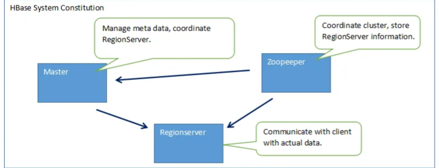

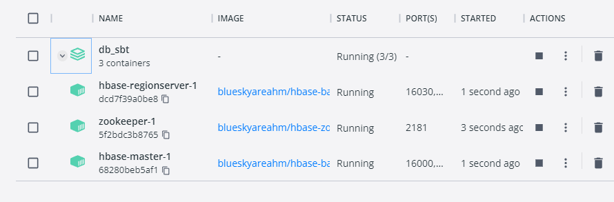

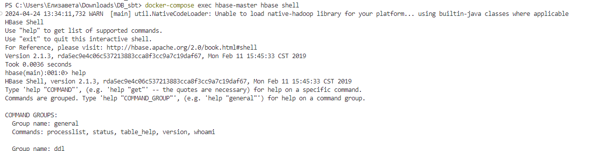

Создаем бд test и проверяем ее существование:

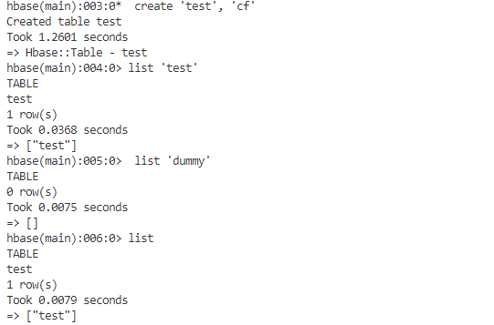

Проверяем бд и делаем запросы на добавление данных:

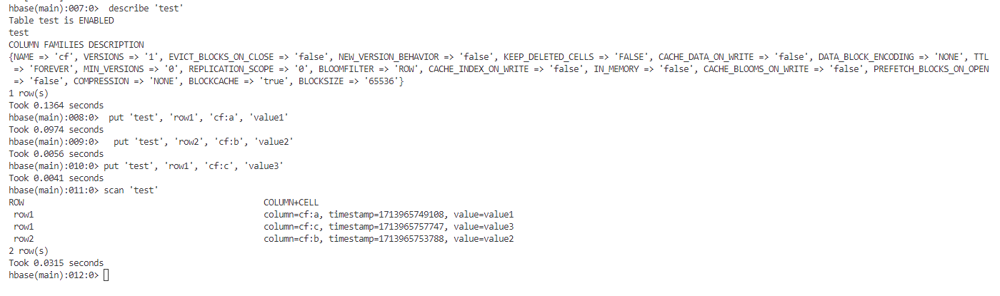

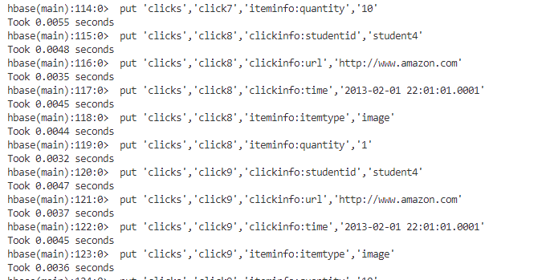

Get запрос и "отлючение" таблицы. 

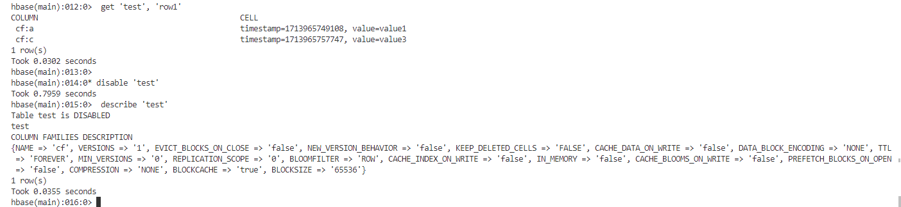

Удаление таблицы, проверка удаления и выход из hbase shell:

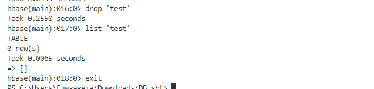

### Распределение файлов БД по разным носителям?

В Apache HBase файлы базы данных распределяются по разным носителям с помощью HDFS (Hadoop Distributed File System). HDFS автоматически распределяет данные по различным узлам в кластере, обеспечивая их репликацию для обеспечения отказоустойчивости. Когда данные записываются в HBase, они разбиваются на регионы, которые затем хранятся в виде HFiles на узлах HDFS. Различные регионы могут быть распределены по разным узлам и даже разным репликам для обеспечения балансировки нагрузки и повышения доступности данных.

### На каком языке/ах программирования написана СУБД?

Написана на Java

### Какие типы индексов поддерживаются в БД? Приведите пример создания индексов.
В Apache HBase все строки всегда сортируются лексикографически по ключу строки. Сортировка происходит по байтам. Это означает, что каждый ключ строки сравнивается на бинарном уровне, байт за байтом, слева направо. Ключи строк всегда уникальны и выступают в качестве основного индекса в Apache HBase.

Хотя Apache HBase не имеет встроенной поддержки для встроенных моделей индексации, вы можете реализовать пользовательские вторичные индексы, чтобы служить альтернативными путями запроса, используя следующие методы:

**Создание индекса в другой таблице** 

— Вы можете поддерживать вторичную таблицу, которая периодически обновляется. Однако, в зависимости от стратегии загрузки, с этим методом связан риск того, что вторичный индекс может потенциально выйти из синхронизации с основной таблицей. Этот риск можно смягчить, если строить вторичный индекс при публикации данных в кластере и выполнять параллельные записи в индексную таблицу.

**Использование фреймворка coprocessor**

— Вы можете воспользоваться фреймворком coprocessor для реализации пользовательских вторичных индексов. Coprocessors действуют подобно триггерам, которые аналогичны хранимым процедурам в СУБД.

**Использование Apache Phoenix**

— Действует как фронт-энд для Apache HBase для преобразования стандартного SQL в нативные сканы и запросы HBase, а также для вторичной индексации.

Например, следующая команда создаст индекс на столбцах v1 и v2, а также включит столбец v3 в индекс, чтобы избежать необходимости получения его из таблицы данных:
`CREATE INDEX my_index ON my_table (v1, v2) INCLUDE (v3);`

### Как строится процесс выполнения запросов в вашей СУБД?

Данные организованы в таблицы, проиндексированные первичным ключом, который в Hbase называется RowKey.
Для каждого RowKey ключа может храниться неограниченны набор атрибутов (или колонок).

Колонки организованны в группы колонок, называемые Column Family. Как правило в одну Column Family объединяют колонки, для которых одинаковы паттерн использования и хранения.

Для каждого аттрибута может храниться несколько различных версий. Разные версии имеют разный timestamp.

Записи физически хранятся в отсортированном по RowKey порядке. При этом данные соответствующие разным Column Family хранятся отдельно, что позволяет при необходимости читать данные только из нужного семейства колонок.

При удалении определённого атрибута физически он сразу не удаляется, а лишь маркируется специальным флажком tombstone. Физическое удаление данных произойдет позже, при выполнении операции Major Compaction.

Атрибуты, принадлежащие одной группе колонок и соответствующие одному ключу физически хранятся как отсортированный список. Любой атрибут может отсутствовать или присутствовать для каждого ключа, при этом если атрибут отсутствует — это не вызывает накладных расходов на хранение пустых значений.

Список и названия групп колонок фиксирован и имеет четкую схему. На уровне группы колонок задаются такие параметры как time to live (TTL) и максимальное количество хранимых версий. Если разница между timestamp для определенно версии и текущим временем больше TTL — запись помечается к удалению. Если количество версий для определённого атрибута превысило максимальное количество версий — запись также помечается к удалению.

Модель данных Hbase можно запомнить как соответствие ключ значение:

<table, RowKey, Column Family, Column, timestamp> -> Value

Список поддерживаемых операций в hbase весьма прост. Поддерживаются 4 основные операции:

— Put: добавить новую запись в hbase. Timestamp этой записи может быть задан руками, в противном случае он будет установлен автоматически как текущее время.

— Get: получить данные по определенному RowKey. Можно указать Column Family, из которой будем брать данные и количество версий которые хотим прочитать.

— Scan: читать записи по очереди. Можно указать запись с которой начинаем читать, запись до которой читать, количество записей которые необходимо считать, Column Family из которой будет производиться чтение и максимальное количество версий для каждой записи.

— Delete: пометить определенную версию к удалению. Физического удаления при этом не произойдет, оно будет отложено до следующего Major Compaction 

Hbase для своей работы использует два основных процесса:

1. Region Server — обслуживает один или несколько регионов. Регион — это диапазон записей соответствующих определенному диапазону подряд идущих RowKey. Каждый регион содержит:

Persistent Storage — основное хранилище данных в Hbase. Данные физически хранятся на HDFS, в специальном формате HFile. Данные в HFile хранятся в отсортированном по RowKey порядке. Одной паре (регион, column family) соответствует как минимум один HFIle.

MemStore — буфер на запись. Так как данные хранятся в HFile d отсортированном порядке — обновлять HFile на каждую запись довольно дорого. Вместо этого данные при записи попадают в специальную область памяти MemStore, где накапливаются некоторое время. При наполнении MemStore до некоторого критического значения данные записываются в новый HFile.

BlockCache — кэш на чтение. Позволяет существенно экономить время на данных которые читаются часто.

Write Ahead Log(WAL). Так как данные при записи попадают в memstore, существует некоторый риск потери данных из-за сбоя. Для того чтобы этого не произошло все операции перед собственно осуществление манипуляций попадают в специальный лог-файл. Это позволяет восстановить данные после любого сбоя.

2. Master Server — главный сервер в кластере hbase. Master управляет распределением регионов по Region Server’ам, ведет реестр регионов, управляет запусками регулярных задач и делает другую полезную работу.

Для координации действий между сервисами Hbase использует Apache ZooKeeper, специальный сервис предназначенный для управления конфигурациями и синхронизацией сервисов.

При увеличении количества данных в регионе и достижении им определенного размера Hbase запускает split, операцию разбивающую регион на 2. Для того чтобы избежать постоянных делений регионов — можно заранее задать границы регионов и увеличить их максимальный размер.

Так как данные по одному региону могут храниться в нескольких HFile, для ускорения работы Hbase периодически их сливает воедино. Эта операция в Hbase называется compaction. Compaction’ы бывают двух видов:

Minor Compaction. Запускается автоматически, выполняется в фоновом режиме. Имеет низкий приоритет по сравнению с другими операциями Hbase.

Major Compaction. Запускается руками или по наступлению срабатыванию определенных триггеров(например по таймеру). Имеет высокий приоритет и может существенно замедлить работу кластера. Major Compaction’ы лучше делать во время когда нагрузка на кластер небольшая. Во время Major Compaction также происходит физическое удаление данных, ране помеченных меткой tombstone.

### Есть ли для вашей СУБД понятие «план запросов»? Если да, объясните, как работает данный этап.

Описано в [Как строится процесс выполнения запросов в вашей СУБД?](#как-строится-процесс-выполнения-запросов-в-вашей-субд)

### Поддерживаются ли транзакции в вашей СУБД? Если да, то расскажите о нем. Если нет, то существует ли альтернатива?
HBase поддерживает ACID в ограниченной степени, предоставляя все гарантии ACID при выполнении операций вставки (put) в одну и ту же строку.  Транзакции в HBase коммитятся строго последовательно, и их фиксация задерживается до завершения предыдущих транзакций
### Какие методы восстановления поддерживаются в вашей СУБД. Расскажите о них.

**Snapshots**

Команда для создания snapshot 

` snapshot 'myTable', 'MySnapShot'`

`hbase(main):003:0>  restore_snapshot 'MySnapShot'`

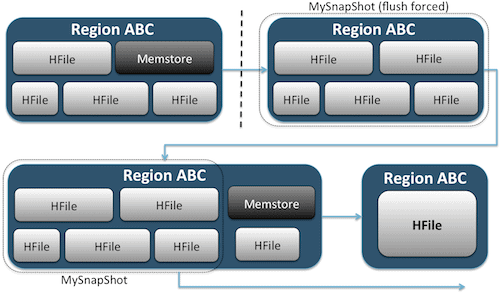

**Replication**

Она может быть настроена на уровне семейства столбцов и работает в фоновом режиме, обеспечивая синхронизацию изменений между кластерами.
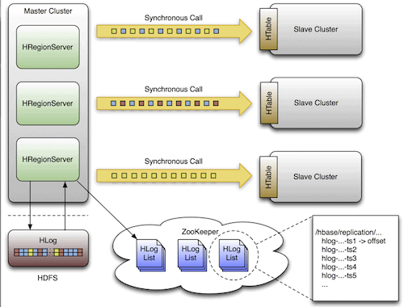
**Export**

Утилита Export в HBase позволяет легко экспортировать данные из таблицы HBase в обычные SequenceFiles в каталоге HDFS. `hbase org.apache.hadoop.hbase.mapreduce.Export  `

**CopyTable**

Утилита CopyTable работает аналогично Export. Она создает задачу MapReduce, использующую API HBase для чтения из исходной таблицы. Основное отличие заключается в том, что CopyTable записывает свой вывод непосредственно в целевую таблицу в HBase, которая может быть локальной для вашего исходного кластера или на удаленном кластере.
`hbase org.apache.hadoop.hbase.mapreduce.CopyTable --new.name=testCopy test`

**HTable API**

Можно написать собственное приложение, использующее общедоступный API и запрашивающее таблицу напрямую.

**Offline backup of HDFS data**

Самый примитивный механизм резервного копирования. Вы можете корректно выключить кластер HBase и вручную скопировать все данные и структуры каталогов, находящиеся в /hbase в вашем кластере HDFS. Поскольку HBase отключен, это гарантирует, что все данные были сохранены в HFiles в HDFS, и вы получите точную копию данных. 

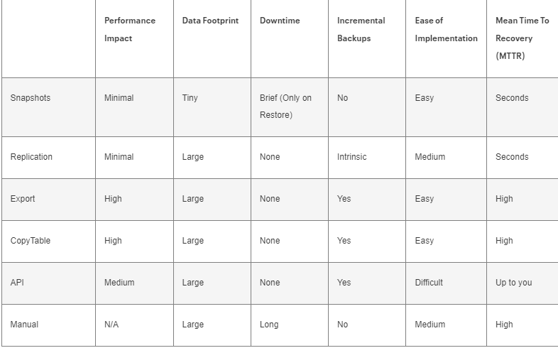

### Расскажите про шардинг в вашей конкретной СУБД. Какие типы используются? Принцип работы.

Автоматическое шардинг: Таблицы HBase распределяются по кластеру с помощью регионов, и регионы автоматически разделяются и перераспределяются по мере роста ваших данных. (также было описано в [Как строится процесс выполнения запросов в вашей СУБД?](#как-строится-процесс-выполнения-запросов-в-вашей-субд))

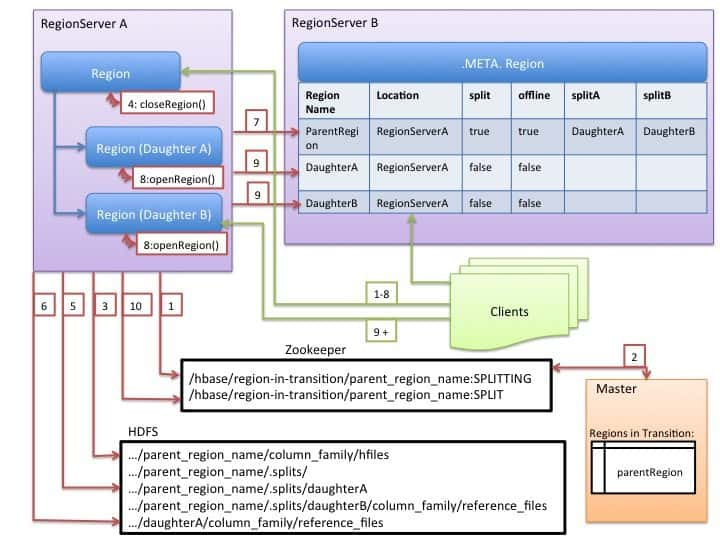

Регионный сервер локально решает разделить регион и готовит его к разделению, создавая znode в ZooKeeper в состоянии SPLITTING.

Мастер узнает об этой znode, так как он следит за родительской znode region-in-transition.

Регионный сервер создает подкаталог ".splits" в директории региона в HDFS.

Регионный сервер закрывает родительский регион, принудительно сбрасывает кэш и помечает регион как офлайн. Клиентские запросы к родительскому региону будут вызывать ошибку NotServingRegionException.

Регионный сервер создает дочерние регионы A и B, разделяет файлы хранилища и создает ссылки на файлы родительского региона.

Регионный сервер создает фактическую директорию региона в HDFS и перемещает ссылки на файлы для каждого дочернего региона.

Регионный сервер обновляет метаданные о разделении региона в таблице .META. и добавляет информацию о дочерних регионах. Клиенты могут обнаружить новые регионы и отправлять запросы к ним.

Регионный сервер открывает дочерние регионы для приема записей.

Регионный сервер добавляет дочерние регионы в .META. и обновляет кэши клиентов.

Регионный сервер обновляет znode в ZooKeeper, чтобы мастер узнал о разделении. Балансировщик может свободно переназначить дочерние регионы другим серверам регионов.

После разделения региона, ссылки на родительский регион будут удалены после компактации файлов данных в дочерних регионах.

Разделение HBase осуществляется путем указания ключа разделения, который используется для разделения таблицы на регионы. Обычно ключ разделения является составным ключом, который включает в себя ключ строки и один или несколько других столбцов.

### Возможно ли применить термины Data Mining, Data Warehousing и OLAP в вашей СУБД?

Когда HBase используется для операций OLAP, предпочтительно настраивать его в защищенном режиме, например, установить более высокое время сеанса ZooKeeper и выделить больше памяти для MemStores (поскольку блочный кэш обычно используется не так часто, так как нагрузка обычно представляет собой длительные сканирования).([Источник](https://hbase.apache.org/book.html#architecture:~:text=possibly%20just%20one.-,When,-HBase%20is%20used))

Data Mining, Data Warehousing не применимы к HBase
HBase преимущественно используется для хранения и доступа к данным, а не для аналитики и обработки данных, что ограничивает его способность выполнять Data Mining, Data Warehousing 

### Какие методы защиты поддерживаются вашей СУБД? Шифрование трафика, модели авторизации и т.п.

Через REST сервер вы можете создавать, удалять таблицы и выполнять другие операции. Кроме того, можно настроить SSL для шифрования данных и использовать REST сервер как шлюз между различными сетями для безопасного доступа к данным.

### Какие сообщества развивают данную СУБД? Кто в проекте имеет права на коммит и создание дистрибутива версий? Расскажите об этих людей и/или компаниях.
[Project team](https://hbase.apache.org/team-list.html)
[HBase issues](https://issues.apache.org/jira/projects/HBASE/issues/HBASE-20448?filter=allopenissues)

### Создайте свои собственные данные для демонстрации работы СУБД. 

Сделано в [Как устроен язык запросов в вашей СУБД? Разверните БД с данными и выполните ряд запросов](#как-устроен-язык-запросов-в-вашей-субд-разверните-бд-с-данными-и-выполните-ряд-запросов)

### Как продолжить самостоятельное изучение языка запросов с помощью демобазы. Если демобазы нет, то создайте ее.

Ознакомление с HBase Shell: Используйте HBase Shell для взаимодействия с демобазой. 

Практика на демобазе: Создавайте таблицы, вставляйте данные, выполняйте запросы и анализируйте результаты.

Изучение продвинутых концепций и оптимизация запросов: После того как вы освоите основы, изучите более продвинутые концепции HBase, такие как фильтрация данных, оптимизация запросов, использование индексов 

Чтение документации и руководств

### Где найти документацию и пройти обучение

[Quick start](https://hbase.apache.org/book.html)

[Установка актуальной версии HBase](https://hbase.apache.org/downloads.html)

### Как быть в курсе происходящего
Можно подписаться на [рассылку](https://hbase.apache.org/mail-lists.html).

Следить за [HBase issues](https://issues.apache.org/jira/projects/HBASE/issues/HBASE-20448?filter=allopenissues)