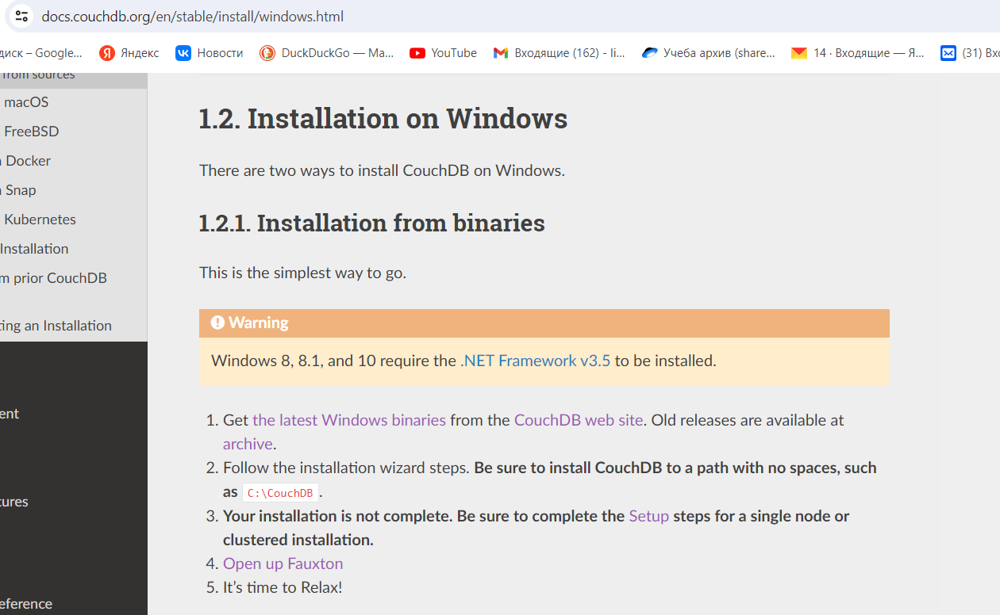
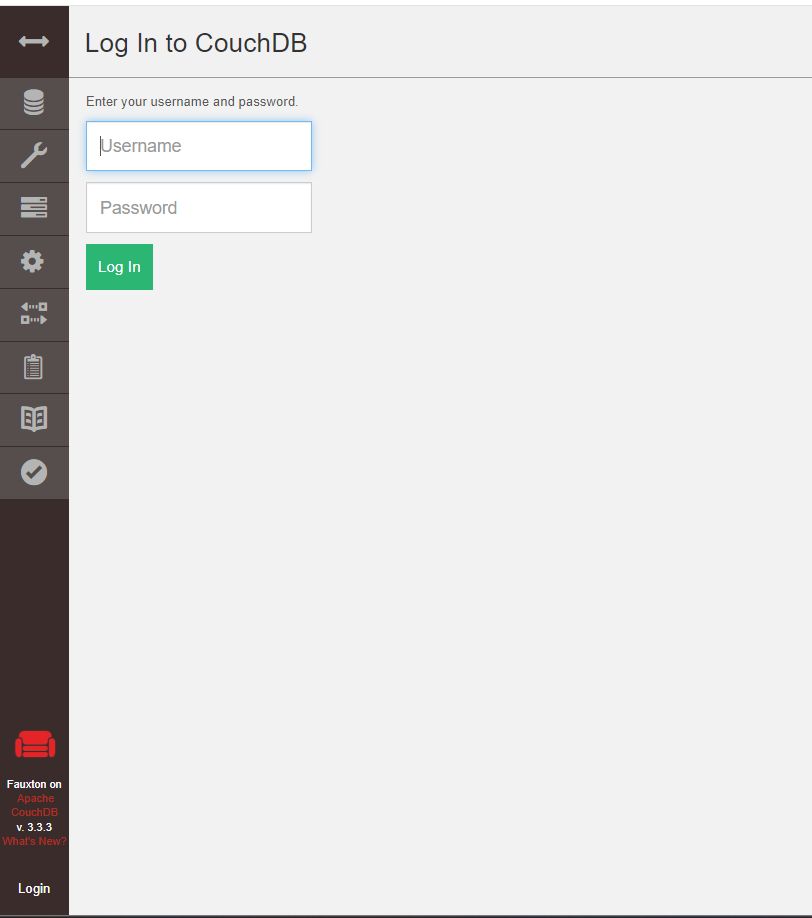
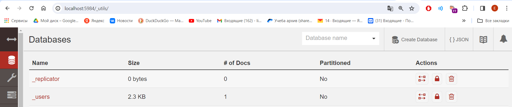
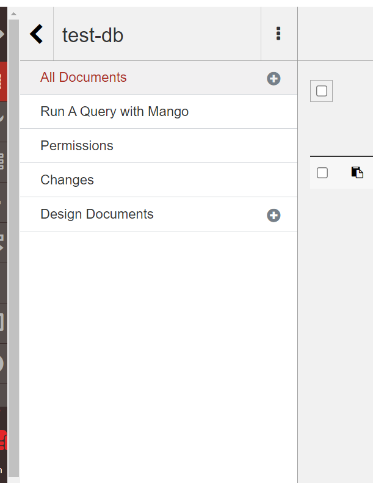
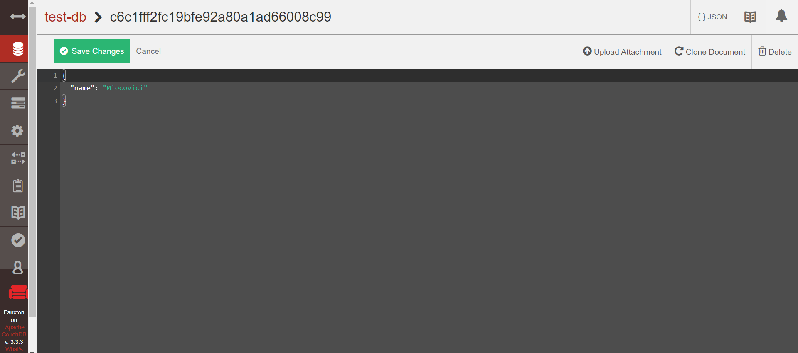
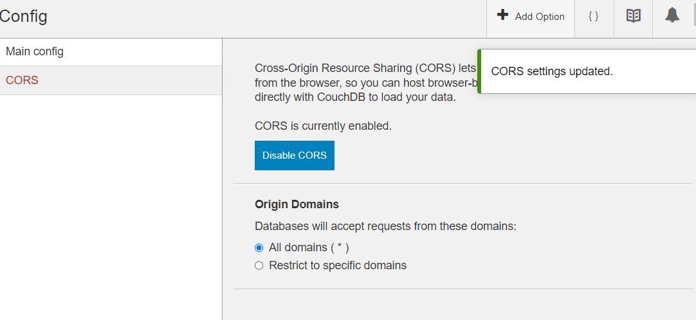
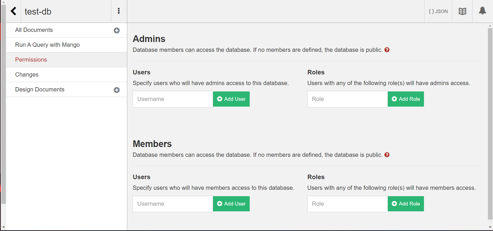
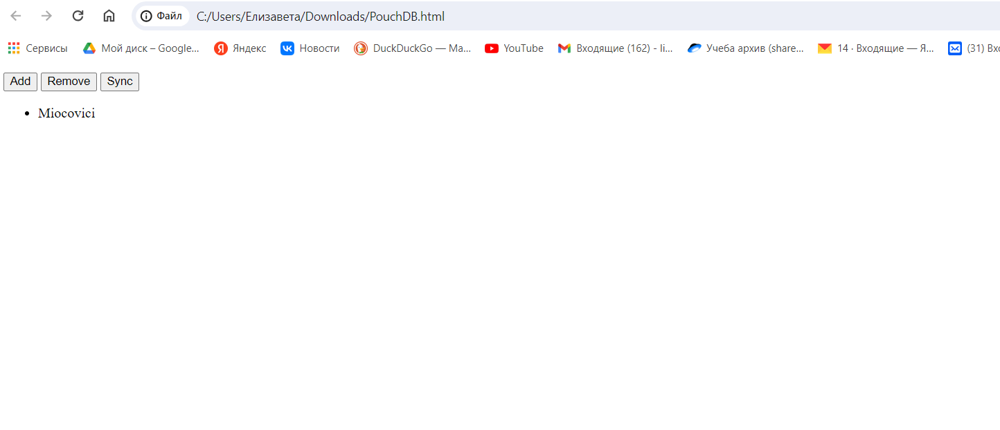
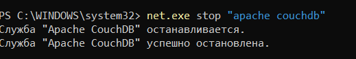

## Установка CouchDB
Задание выполнено в ОС Windows 

Установка выполнена как указано на оф. сайте:

## Создание БД

Создаем БД в CouchDB`test-db`

Добавляем в БД один документ в котором должно быть поле «name».

Прописываем в ДЗ_2.html путь к инсталляции CouchDB:
`Remote: new PouchDB('http://localhost:5984/test-db')`

Настраиваем CORS:

Настраиваем permissions:

Запускаем PouchDB_hw.html и нажимаем кнопку «sync». 

Останавливаем CouchDB: `net.exe stop "apache couchdb"`

Обновляем PouchDB_hw.html и в нем по прежнему отображается фамилия.