# Установка Redis
Вначале установим необходимые зависимости

```bash
sudo apt-get update
sudo apt install make gcc libc6-dev tcl build-essential
```

Скачиваем архив

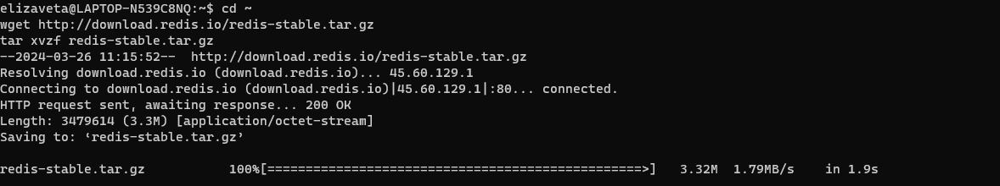

Скомпилируем скачанные файлы:

```
tar -xzvf redis-stable.tar.gz
cd redis-stable
```

Установка зависимостей для сборки Redis.

```
cd redis-stable/deps
make hiredis lua jemalloc linenoise
```

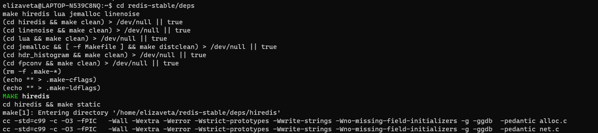

Запустим тесты

```bash
cd ~/redis-stable
make
```

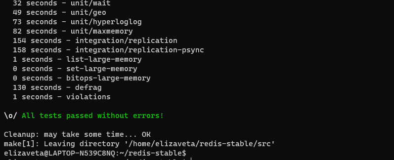

### Создание кластера

```bash
mkdir cluster-test
cd cluster-test
mkdir 7000 7001 7002 7003 7004 7005 
```

В каждой папке создадим конфигурационный файл вида:

```bash
port <port number>
cluster-enabled yes
cluster-config-file nodes.conf
cluster-node-timeout 5000
appendonly yes
```

В каждой папке запустим `redis-server ./redis.conf`

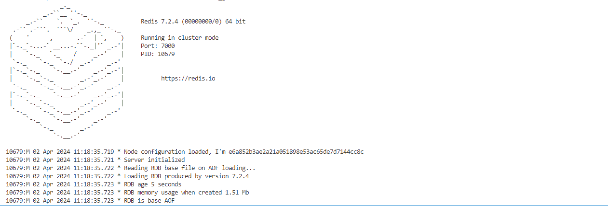

После того, как все ноды запущены создадим кластер:

 `redis-cli --cluster create 127.0.0.1:7000 127.0.0.1:7001 \
127.0.0.1:7002 127.0.0.1:7003 127.0.0.1:7004 127.0.0.1:7005 \
--cluster-replicas 1`

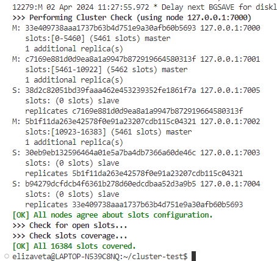

Проверим ноды:

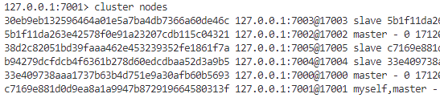

### Заполнение БД

4 json файла для заполнения БД:

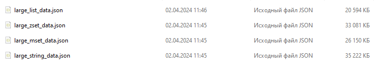

Для заполнения бд я использовала скрипт create_db.py и read_from_db.py для чтения.
Скорость заполнения/чтения для разных сруктур:

#### строка

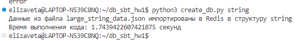

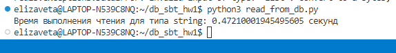

Перед заполнением бд очистим ее: `rc.flushall()`

#### hset 

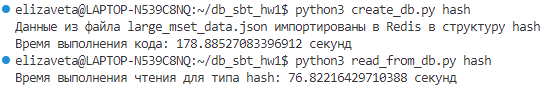

#### zset

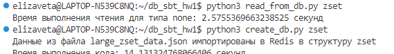

#### list

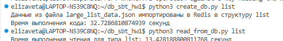